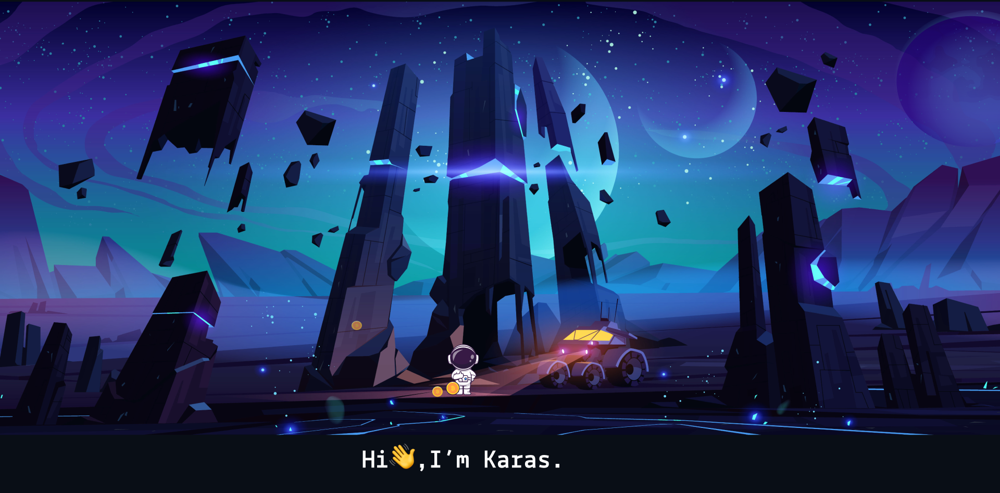

<picture>

</picture>

    <samp>
        Fullstack Developer | Web3 Builder
    </samp>

    <samp>
        "It’s not a bug – it’s an undocumented feature." 👾️
    </samp>

<picture>
    
</picture>

   

- 🌱 I’m currently working in **Starknet**
- ✧˖ Read about me at: ***https://www.karasbuilder.com/***
- ✉ You can reach me at: karasbuilder@gmail.com
- 💬 I know about _MERN, Solidity, Nest.JS, Next.JS,..._
- ⚡ Fun fact **I Like Listen To Music , Drink coffe ...**

 
 
 
 
 
 
<picture>
      
</picture> 
<picture>
      
</picture>

